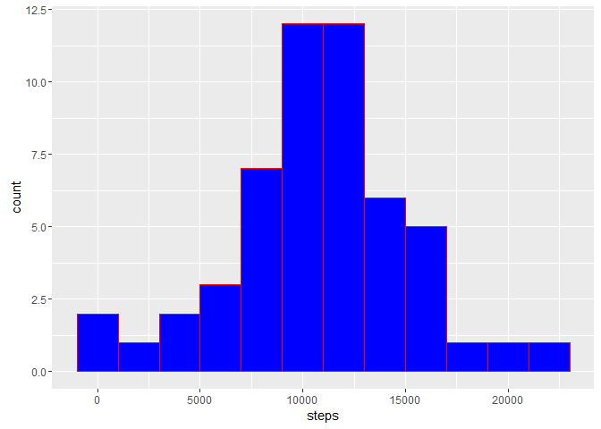
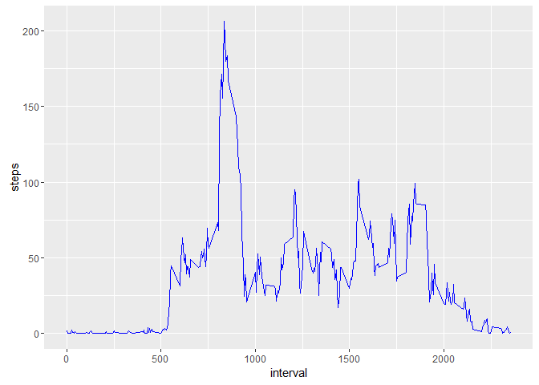
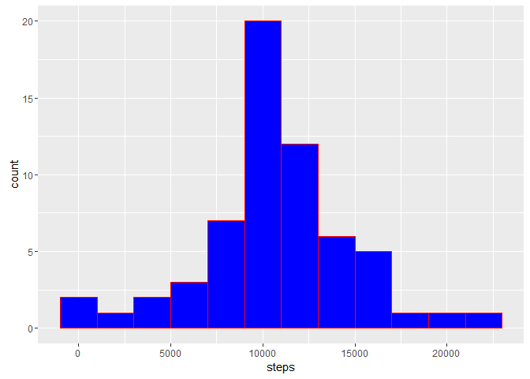
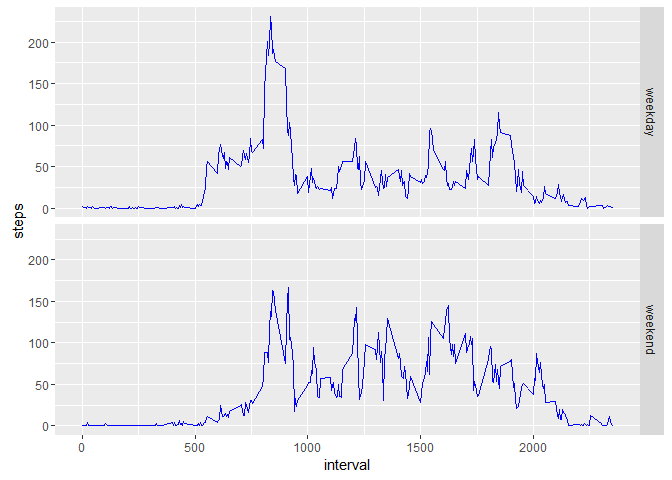

# Reproducible Research: Peer Assessment 1


## Loading and preprocessing the data

1. Load the data

```r
fileName = "activity.csv"
if (!exists(fileName)) {
    unzip("activity.zip")
}
dt <- read.csv(fileName)
```
2. Transform to date

```r
dt$date <- as.Date(as.character(dt$date), "%Y-%m-%d")
```

## What is mean total number of steps taken per day?

1. Calculate the total number of steps taken per day

```r
totalStep <- aggregate(steps ~ date, data = dt, FUN = sum)
```

2. Make a histogram of the total number of steps taken each day

```r
library(ggplot2)
qplot(steps, data = totalStep, binwidth = 2000, fill = I("blue"), color = I("red"))
```



3. Calculate and report the mean and median of the total number of steps taken per day

```r
mean(totalStep$steps)
```

```
## [1] 10766.19
```

```r
median(totalStep$steps)
```

```
## [1] 10765
```

## What is the average daily activity pattern?

1. Make a time series plot (i.e. type = "l") of the 5-minute interval (x-axis) and the average number of steps taken, averaged across all days (y-axis)

```r
library(ggplot2)
intervalStep <- aggregate(steps ~ interval, data = dt, FUN = mean)
qplot(interval, steps, data = intervalStep, geom = "line", color = I("blue"))
```



2. Which 5-minute interval, on average across all the days in the dataset, contains the maximum number of steps?

```r
maxStep <- which.max(intervalStep$steps)
intervalStep$interval[maxStep]
```

```
## [1] 835
```

## Imputing missing values

1. Calculate and report the total number of missing values in the dataset (i.e. the total number of rows with NAs)

```r
totalMissing <- sum(is.na(dt$steps))
```
Total number of missing values: 2304

2. The strategy for filling in all of the missing values in the dataset is assgining the mean for that 5-minute interval in variable intervalStep above.

3. Create a new dataset that is equal to the original dataset but with the missing data filled in.

```r
newDt <- dt
for (i in 1:nrow(newDt)) {
    if (is.na(newDt$steps[i])) {
        newDt$steps[i] <- intervalStep$steps[intervalStep$interval == newDt$interval[i]]
    }
}
```

4. Make a histogram of the total number of steps taken each day and Calculate and report the mean and median total number of steps taken per day. Do these values differ from the estimates from the first part of the assignment? What is the impact of imputing missing data on the estimates of the total daily number of steps?
- Histogram of total steps each day

```r
totalStep2 <- aggregate(steps ~ date, data = newDt, FUN = sum)
library(ggplot2)
qplot(steps, data = totalStep2, binwidth = 2000, fill = I("blue"), color = I("red"))
```



- Calculate the mean and median steps per day

```r
mean(totalStep2$steps)
```

```
## [1] 10766.19
```

```r
median(totalStep2$steps)
```

```
## [1] 10766.19
```

- Imputing missing data by the mean of 5-minute interval does not have big impact on the mean and median of steps per day.

## Are there differences in activity patterns between weekdays and weekends?

1. Create a new factor variable in the dataset with two levels - "weekday" and "weekend" indicating whether a given date is a weekday or weekend day.

```r
newDt$day <- ifelse(weekdays(newDt$date) == "Saturday" | weekdays(newDt$date) == "Sunday", "weekend", "weekday")
newDt$day <- as.factor(newDt$day)
```

2. Make a panel plot containing a time series plot (i.e. type = "l") of the 5-minute interval (x-axis) and the average number of steps taken, averaged across all weekday days or weekend days (y-axis).

```r
library(ggplot2)
dayStep <- aggregate(steps ~ interval + day, data = newDt, FUN = mean)
qplot(interval, steps, data = dayStep, geom = "line", color = I("blue"), facets = day ~ .)
```


